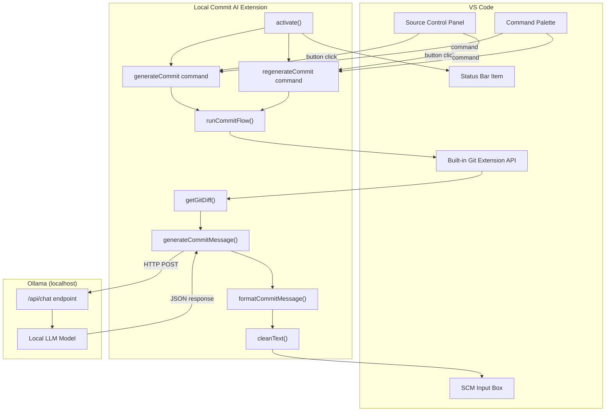
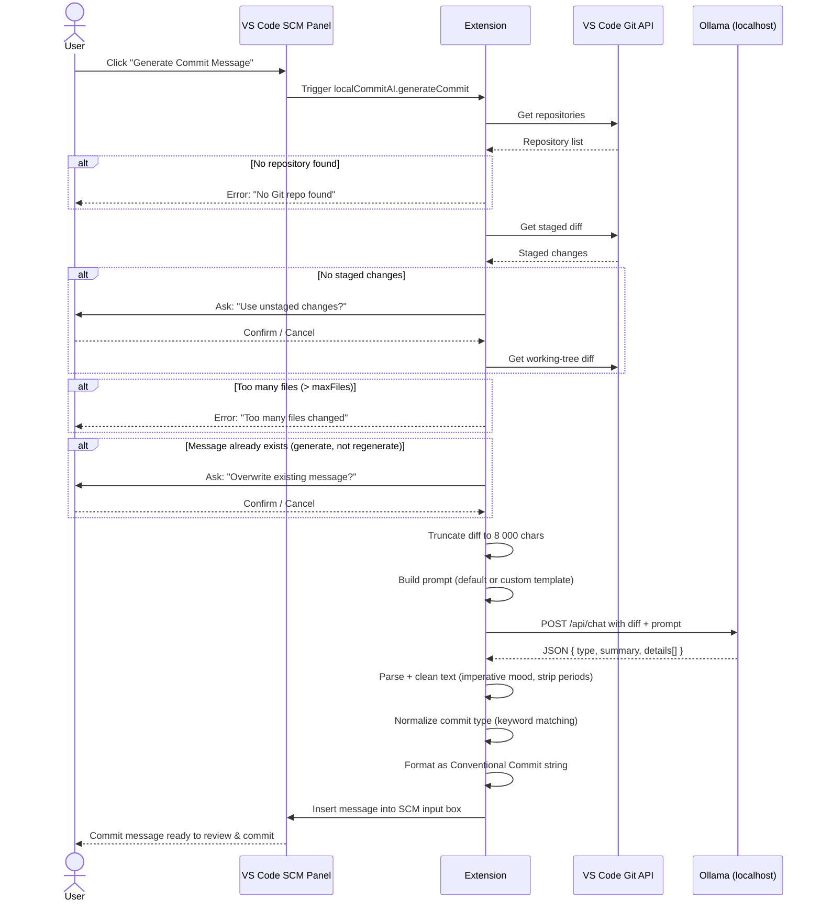
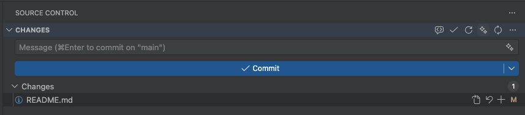
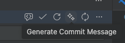
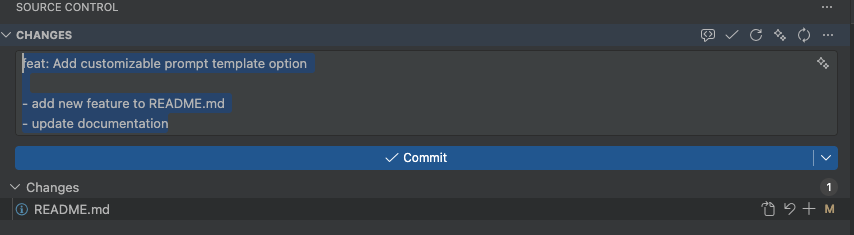
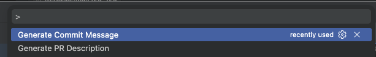
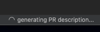
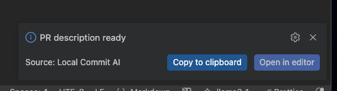
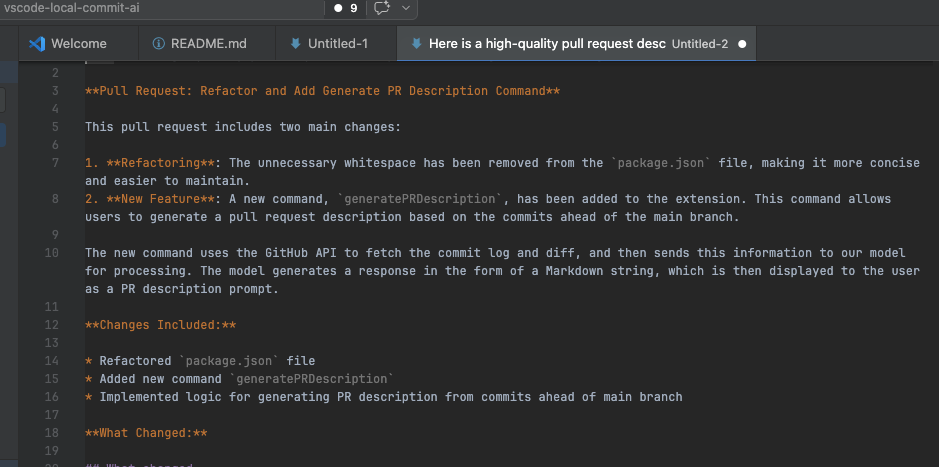
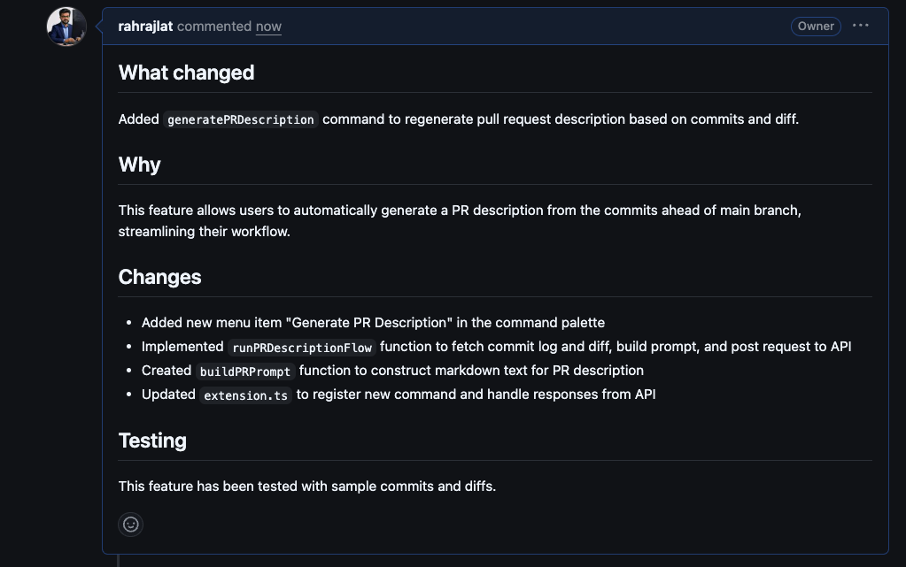

<h1 align="center">Local Commit AI</h1>
<h1 align="center">Local Commit AI</h1>

<p align="center">
  AI-powered git commit messages — fully local, fast, and private.<br/>
  No API keys &bull; No cloud &bull; No data leaving your machine
</p>

<p align="center">
  <a href="https://marketplace.visualstudio.com/items?itemName=rahul-devlocal-commit-ai.local-commit-ai">
    
  </a>
  <a href="https://marketplace.visualstudio.com/items?itemName=rahul-devlocal-commit-ai.local-commit-ai">
    
  </a>
  
  
  
  
</p>

<p align="center">
  
</p>

---

## Overview

**Local Commit AI** is a VS Code extension that generates [Conventional Commits](https://www.conventionalcommits.org/)-formatted git commit messages using a **local LLM via [Ollama](https://ollama.com)**. Every step — from diff analysis to message generation — runs entirely on your machine. No telemetry, no API keys, no network requests.


---

## Table of Contents

- [Features](#features)
- [Architecture](#architecture)
- [How It Works](#how-it-works)
- [Requirements](#requirements)
- [Installation](#installation)
- [Quick Start](#quick-start)
- [Configuration](#configuration)
- [Commands](#commands)
- [PR Description Generation](#pr-description-generation)
- [Commit Format](#commit-format)
- [Troubleshooting](#troubleshooting)
- [About the Author](#about-the-author)
- [Privacy](#privacy)
- [License](#license)

---

## Features

- **Zero cloud dependency** — runs fully offline via Ollama
- **Staged & unstaged diff support** — analyzes staged changes first, falls back to unstaged with confirmation
- **Conventional Commits output** — structured `<type>: <summary>` with optional bullet-point body
- **One-click insertion** into VS Code's Source Control input box
- **Customizable prompt templates** — override the default prompt for domain-specific instructions
- **Any Ollama model** — works with `llama3.1`, `mistral`, `codellama`, and more
- **File-count guard** — blocks generation if too many files are staged, preventing noisy commits
- **Status bar indicator** — shows active model, clickable to open settings
- **PR description generation** — generates a full GitHub-ready pull request description from your branch commits and diff, with one-click copy or open in editor

---

## Architecture

The extension is a focused single-file TypeScript module that wires together VS Code's Git API, the Ollama HTTP API, and the SCM input box.



---

## How It Works

The following sequence diagram shows the full request lifecycle from a user click to a commit message appearing in the input box.



---

## Requirements

- [Ollama](https://ollama.com) installed and running locally
- At least one model pulled — e.g. `ollama pull llama3.1`
- A git repository open in VS Code

---

## Installation

**VS Code Marketplace**

Search for **Local Commit AI** in the Extensions panel, or go directly to the [VS Code Marketplace](https://marketplace.visualstudio.com/items?itemName=rahul-devlocal-commit-ai.local-commit-ai).

**Manual install from `.vsix`**

Download the latest `.vsix` from [Releases](https://github.com/RahulRajasekharan/local-commit-ai/releases), then:

```
Extensions panel → ··· menu → Install from VSIX…
```

---

## Quick Start

```bash
# 1. Install and start Ollama
ollama pull llama3.1          # or mistral, codellama, etc.

# 2. Verify Ollama is running
curl http://localhost:11434   # should return "Ollama is running"
```

3. Open a git repository in VS Code and stage your changes.
4. Click the **Generate Commit Message** button (✨) in the Source Control toolbar.
5. Review the generated message and commit.

---

## Screenshots

### Commit Message Generation

| | |
|---|---|
|  |  |
| _Staged changes ready_ | _Generate button_ |
|  | |
| _Message inserted_ | |

### PR Description Generation

| | |
|---|---|
|  |  |
| _Command palette with "Generate PR Description"_ | _Generating in progress_ |
|  |  |
| _Ready — copy to clipboard or open in editor_ | _Full description in editor_ |
|  | |
| _Result pasted directly into a GitHub PR_ | |

---

## Configuration

All settings live under the `localCommitAI` namespace in VS Code settings (`Cmd+,` / `Ctrl+,`).

| Setting | Type | Default | Description |
|---|---|---|---|
| `localCommitAI.ollamaHost` | `string` | `http://localhost:11434` | Ollama server URL |
| `localCommitAI.model` | `string` | `llama3.1` | Model to use for generation |
| `localCommitAI.maxFiles` | `number` | `20` | Max changed files before generation is blocked |
| `localCommitAI.promptTemplate` | `string` | `""` | Custom prompt template — use `{{diff}}` as the diff placeholder |

**Example `.vscode/settings.json`:**

```json
{
  "localCommitAI.model": "codellama",
  "localCommitAI.maxFiles": 30,
  "localCommitAI.promptTemplate": "You are a senior engineer. Write a commit message for this diff:\n{{diff}}"
}
```

---

## Commands

| Command | ID | Description |
|---|---|---|
| Generate Commit Message | `localCommitAI.generateCommit` | Generates a message from the current diff; prompts for confirmation if a message already exists |
| Regenerate Commit Message | `localCommitAI.regenerateCommit` | Always regenerates, overwriting any existing message without prompting |
| Generate PR Description | `localCommitAI.generatePRDescription` | Generates a GitHub-ready PR description from commits and diff since the main branch |

Access via the **Source Control toolbar** or **Command Palette** (`Cmd+Shift+P` / `Ctrl+Shift+P`).

### Tweaking a message

After a message is generated, a **Tweak it** button appears. Clicking it opens a quick-pick menu with preset options:

- Make it shorter
- Add more detail
- Change type to `feat`, `fix`, `refactor`, or `chore`
- Custom — type your own instruction

The message is regenerated based on your feedback, and you can keep tweaking until you're satisfied.

---

## PR Description Generation

The **Generate PR Description** command builds a full pull request description by analyzing all commits and the diff between your current branch and `main`. It constructs a structured markdown description covering what changed, why, and how to test — ready to paste directly into GitHub.

**How to use:**

1. Open the **Command Palette** (`Cmd+Shift+P` / `Ctrl+Shift+P`) and run **Generate PR Description**.
2. Wait for the "generating PR description..." indicator to complete.
3. When the "PR description ready" notification appears, choose:
   - **Copy to clipboard** — paste it straight into GitHub's PR body field
   - **Open in editor** — review and edit before copying

The generated description follows a structured format with sections for what changed, a list of specific changes, and testing notes.

---

## Commit Format

Generated messages follow the [Conventional Commits](https://www.conventionalcommits.org/) specification:

```
<type>: <summary in imperative mood>

- detail 1
- detail 2
```

**Supported types:**

| Type | When used |
|---|---|
| `feat` | New feature or capability added |
| `fix` | Bug fix or error correction |
| `refactor` | Code restructuring without behavior change |
| `chore` | Tooling, config, docs, or housekeeping |

---

## Troubleshooting

| Symptom | Solution |
|---|---|
| _"Ollama request failed"_ | Run `ollama serve`; verify `ollamaHost` in settings; run `ollama list` to confirm model exists |
| _"No Git repo found"_ | Open a folder that contains a `.git` directory |
| _"No changes found"_ | Stage files or ensure unstaged changes are present |
| _"Too many files changed"_ | Increase `localCommitAI.maxFiles` or reduce the number of staged files |
| Poor commit message quality | Try a larger/code-focused model (`codellama`, `mistral`) or supply a custom `promptTemplate` |
| Status bar shows wrong model | Change `localCommitAI.model` — the status bar updates live |

---

## About the Author

Built by **Rahul Rajasekharan** — engineer and maker of things.

Check out more projects and writing at [rahulrajasekharan.dev](https://www.rahulrajasekharan.dev/).

If Local Commit AI saves you time, a ⭐ on [GitHub](https://github.com/RahulRajasekharan/local-commit-ai) goes a long way — it helps others find the project too. Thank you!

---

## Privacy

All processing happens locally on your machine. Your code and diffs are **never transmitted to any external service**. The only network traffic is between the extension and your local Ollama instance (`localhost`).

---

## License

[MIT](LICENSE) © [Rahul Rajasekharan](https://github.com/RahulRajasekharan)
