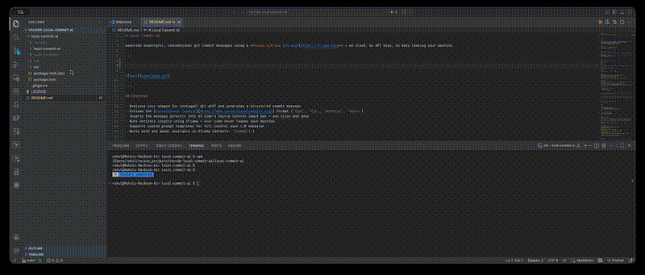

# Local Commit AI

Generate meaningful, conventional git commit messages using a **local LLM via [Ollama](https://ollama.com)** — no cloud, no API keys, no data leaving your machine.

---



---

## Features

- Analyzes your staged (or unstaged) git diff and generates a structured commit message
- Follows the [Conventional Commits](https://www.conventionalcommits.org/) format (`feat`, `fix`, `refactor`, `chore`)
- Inserts the message directly into VS Code's Source Control input box — one click and done
- Runs entirely locally using Ollama — your code never leaves your machine
- Supports custom prompt templates for full control over LLM behavior
- Works with any model available in Ollama (default: `llama3.1`)

---

## Requirements

- [Ollama](https://ollama.com) installed and running locally
- At least one model pulled in Ollama (e.g. `llama3.1`)
- A git repository open in VS Code

---

## Installation

### From the VS Code Marketplace

Search for **Local Commit AI** in the Extensions panel (`Ctrl+Shift+X` / `Cmd+Shift+X`) and click Install.

### From a `.vsix` file

1. Download the `.vsix` file from the [Releases](https://github.com/RahulRajasekharan/local-commit-ai/releases) page
2. Open VS Code and go to Extensions (`Ctrl+Shift+X`)
3. Click the `...` menu → **Install from VSIX...**
4. Select the downloaded file

---

## Setup

### 1. Install Ollama

Download and install Ollama from [ollama.com](https://ollama.com).

### 2. Pull a model

```bash
ollama pull llama3.1
```

Any model supported by Ollama will work. Smaller models like `phi3` or `mistral` are faster; larger ones like `llama3.1` produce higher quality output.

### 3. Start Ollama

Ollama typically starts automatically. To verify it's running:

```bash
ollama serve
```

It should be accessible at `http://localhost:11434` by default.

---

## Usage

1. Stage your changes in git (`git add ...` or use VS Code's Source Control panel)
2. Open the **Source Control** panel (`Ctrl+Shift+G`)
3. Click the **Generate Commit Message** button in the Source Control toolbar
4. The commit message is automatically inserted into the input box
5. Review and commit

If no staged changes are found, the extension will offer to use your unstaged changes instead.

---

## Configuration

Open VS Code Settings (`Ctrl+,`) and search for **Local Commit AI**, or edit your `settings.json` directly:

| Setting | Default | Description |
|---|---|---|
| `localCommitAI.ollamaHost` | `http://localhost:11434` | URL where Ollama is running |
| `localCommitAI.model` | `llama3.1` | Ollama model to use for generation |
| `localCommitAI.maxFiles` | `20` | Maximum number of changed files allowed before generation is blocked |
| `localCommitAI.promptTemplate` | `""` | Custom prompt template (use `{{diff}}` as placeholder for the git diff) |

### Example `settings.json`

```json
{
  "localCommitAI.ollamaHost": "http://localhost:11434",
  "localCommitAI.model": "mistral",
  "localCommitAI.maxFiles": 10,
  "localCommitAI.promptTemplate": ""
}
```

### Custom Prompt Template

You can override the default prompt with your own. Use `{{diff}}` where you want the git diff to be inserted:

```json
{
  "localCommitAI.promptTemplate": "Write a concise conventional commit message for this diff:\n\n{{diff}}\n\nReturn only the commit message, nothing else."
}
```

Leave this empty to use the built-in prompt, which returns structured JSON with type, summary, and bullet-point details.

---

## Commit Message Format

Generated messages follow the Conventional Commits spec:

```
<type>: <short summary>

- detail 1
- detail 2
```

**Types:**
- `feat` — new functionality
- `fix` — bug fix or incorrect behavior resolved
- `refactor` — structural improvement without behavior change
- `chore` — docs, formatting, renaming, config, non-functional changes

**Example output:**

```
feat: add user authentication middleware

- Introduce JWT-based token validation
- Add route guard for protected endpoints
- Update user model to store hashed tokens
```

---

## Commands

| Command | Icon | Description |
|---|---|---|
| `Generate Commit Message` | ✨ | Generate a commit message from the diff; prompts before overwriting an existing message |
| `Regenerate Commit Message` | 🔄 | Always regenerates without prompting, even if a message already exists |

Both buttons appear as icons in the Source Control panel toolbar, directly above the commit message input box.

Access via:
- Source Control toolbar buttons
- Command Palette (`Ctrl+Shift+P`) → `Generate Commit Message` or `Regenerate Commit Message`

---

## Troubleshooting

**"Ollama request failed"**
- Ensure Ollama is running: `ollama serve`
- Check the host URL in settings matches where Ollama is listening
- Verify the model is pulled: `ollama list`

**"No Git repo found"**
- Make sure you have a folder open in VS Code that contains a `.git` directory

**"No changes found"**
- Stage at least one file, or choose to use unstaged changes when prompted

**"Too many files changed"**
- Generation is blocked when the number of changed files exceeds `localCommitAI.maxFiles` (default: 20)
- Either stage a smaller, focused set of changes, or increase the limit in settings

**Message quality is poor**
- Try a larger or more capable model (e.g. `llama3.1`, `mixtral`, `qwen2.5-coder`)
- Use a custom `promptTemplate` tuned to your project's conventions

---

## Privacy

All processing happens locally on your machine. Your code and diffs are sent only to your local Ollama instance and never to any external server.

---

## Development

```bash
# Clone the repo
git clone <repo-url>
cd local-commit-ai

# Install dependencies
npm install

# Compile TypeScript
npm run compile

# Watch mode
npm run watch

# Package as .vsix
npm run package
```

Press `F5` in VS Code to launch an Extension Development Host for testing.

---

## License

MIT

---

## Author

Rahul Rajasekharan  
Senior Data Engineer
